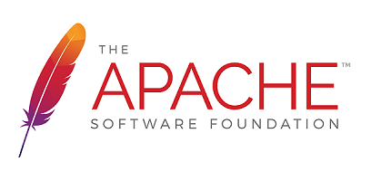

  
  # a project
  ### Table of Contents
  1. [Program Description.](#description)
  2. [Program Installation.](#installation)
  3. [Program Usage.](#usage)
  4. [Licensing.](#license)
  5. [How to Contribute.](#contribute)
  6. [How to Test.](#test)
  7. [Question?](#quests)
  
  ## Program Description:
  
  the project
  
  ## Installation:
  
  install
  
  ## Program Usage:
  
  dd
  
  ## License Type: 
  
  The Apache License is a permissive free software license written by the Apache Software Foundation (ASF).[5] It allows users to use the software for any purpose, to distribute it, to modify it, and to distribute modified versions of the software under the terms of the license, without concern for royalties. The ASF and its projects release their software products under the Apache License. The license is also used by many non-ASF projects.
  [Wikipedia](https://en.wikipedia.org/wiki/Apache_License)
  
  ## How to contribute:
  
  contribute
  
  ## How to test:
  
  test
  
  ## Questions
  
  [Github repositry](https://github.com/jj)
  If you have any questions please [email me](mailto:dd). 
     
  
  