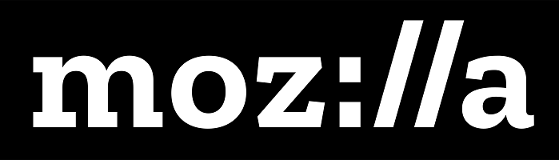

# zz
### Table of Contents
1. [Program Description.](#description)
2. [Program Installation.](#installation)
3. [Program Usage.](#usage)
4. [Licensing.](#license)
5. [How to Contribute.](#contribute)
6. [How to Test.](#test)
7. [Question?](#questions)

## Program Description:

zz

## Installation:

zz

## Program Usage:

zz

## License Type: 

The Mozilla Public License (MPL) is a free and open source software license developed and maintained by the Mozilla Foundation. It is a weak copyleft license, characterized as a middle ground between permissive free software licenses and the GNU General Public License (GPL), that seeks to balance the concerns of proprietary and open source developers. As such, it allows re-licensing. MPL software can thus be converted into a copyleft license such as the GPL, or to a proprietary license.
[Wikipedia](https://en.wikipedia.org/wiki/Mozilla_Public_License)

## How to contribute:

zz

## How to test:

zz

## Questions
    
