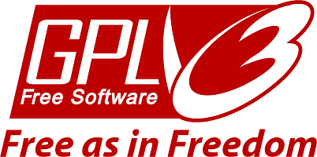

 # readme-generator

 ### Table of Contents
1. [Program Description.](#description)
2. [Program Installation.](#installation)
3. [Program Usage.](#usage)
4. [Licensing.](#license)
5. [How to Contribute.](#contribute)
6. [How to Test.](#test)

 ## Program Description:
 
 Generates a readme
 ## Installation:
 
 install it
 ## Program Usage:
 
 Use it
 ## License Type: 
 
 The GNU General Public License (GNU GPL or GPL) is a series of widely used free software licenses that guarantee end users the freedom to run, study, share, and modify the software.[7] The licenses were originally written by Richard Stallman, former head of the Free Software Foundation (FSF), for the GNU Project, and grant the recipients of a computer program the rights of the Free Software Definition.[8] The GPL series are all copyleft licenses, which means that any derivative work must be distributed under the same or equivalent license terms. This is in distinction to permissive software licenses, of which the BSD licenses and the MIT License are widely used less-restrictive examples. GPL was the first copyleft license for general use.
 [Wikipedia](https://en.wikipedia.org/wiki/GNU_General_Public_License)

 ## How to contribute:
 
 Contribute
 ## How to test:
 
 test it
##[Email me](mailto:terrylthompsonintx@gmail.com)

