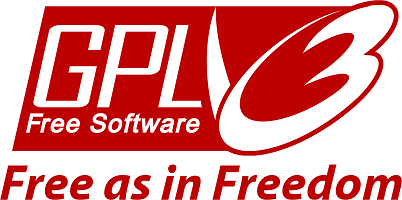

  
  # Readme Generator
  ### Table of Contents
  1. [Program Description.](#program-description)
  2. [Program Installation.](#installation)
  3. [Program Usage.](#program-usage)
  4. [Licensing.](#license-type)
  5. [How to Contribute.](#how-to-contribute)
  6. [How to Test.](#how-to-test)
  7. [Question?](#questions)
  
  ## Program Description:
  A professional readme generator
  
  ## Installation:
  Copy the folder structure locally. 
  
  ## Program Usage:
  Launch with node readme.js and follow prompts.
  
  ## License Type: 
  The GNU General Public License (GNU GPL or GPL) is a series of widely used free software licenses that guarantee end users the freedom to run, study, share, and modify the software.[7] The licenses were originally written by Richard Stallman, former head of the Free Software Foundation (FSF), for the GNU Project, and grant the recipients of a computer program the rights of the Free Software Definition.[8] The GPL series are all copyleft licenses, which means that any derivative work must be distributed under the same or equivalent license terms. This is in distinction to permissive software licenses, of which the BSD licenses and the MIT License are widely used less-restrictive examples. GPL was the first copyleft license for general use.
  [Wikipedia](https://en.wikipedia.org/wiki/GNU_General_Public_License)
  
  ## How to contribute:
  If you find an issue email me with your corrections. 
  
  ## How to test:
  No tests.
  
  ## Questions
  [Github repository](https://github.com/terrylthompsonintx)
  If you have any questions please [email me](mailto:terrylthompsonintx@gmail.com). 
     
  